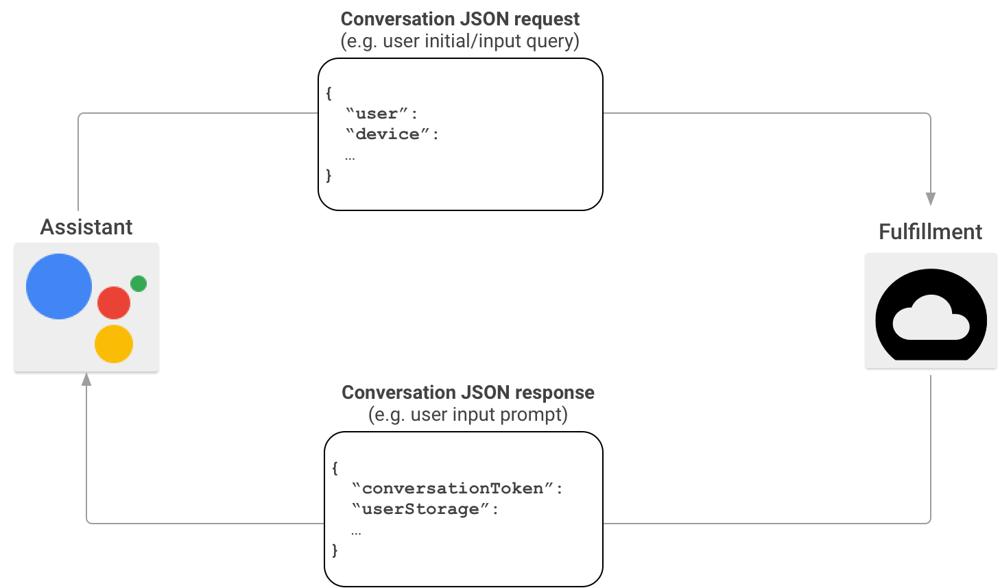
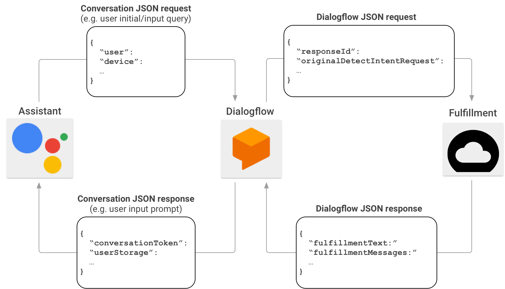

author: Mathias Johan Johansen and Ingrid Grønlie Guren 
id: introduction-to-voice-assistant

<a name="introductiontovoiceassistantwithgooglehome"></a>

#Introduction to Voice Assistant with Google Home

<a name="welcome!👋"></a>

##Welcome ! 👋

Welcome to this workshop: An introduction to Voice Assistant with Google Cloud. 

The workshop is split in two parts. Part 1 lets you explore Dialogflow to setup your own intent fulfillment, and in part 2 you will use Webhook intent fulfillment instead. 

Each tasks has written 


<a name="aboutthedifferentpartsintheworkshop:"></a>

###About the different parts in the workshop:
*What we will do:* Gives an introduction to the task we are going to solve
*Terminology:* Written explanation about the different   

<a name="whatwewilldotoday:"></a>

##What we will do today:
<a name="drone'screamvoiceapp"></a>

###Drone's Cream voice app

In this workshop you will create a voice assistant app for the fictional but awesome online ice cream shop Drone's Cream. 

Drone's Cream's value proposition is quite simple. _"We deliver the world's best ice cream by drone"_. To be able to fully exploit the ice cream hunger of the world they need to be able to take orders by voice from over heated people 
stuck outside in the sun.

The task is split into two parts. For the first part you need to set up a voice assistant app with both static and
dynamic answers without hooking up to a separate backend. In part two you will have to connect the app from part one to
a Node.js backend provided to you.

We will be using tools such as Actions on Google, Dialogflow, the Node.js Dialogflow Fulfillment Library and the 
Actions on Google Node.js client library all of which will be explained to you throughout.


<a name="terminology"></a>

##Terminology

What we will be creating today is an app for Google Assistant. Google Assistant is the software that enables different 
devices, such as Android phones and the Google Home smart speaker, to have fluent conversations with a user. 

Google Assistant creates one common interface for all these pieces of hardware, allowing us to support them all with a 
single implementation. The only thing that might change between devices is what kind of inputs and outputs they support.

For instance: a Google Home smart speaker does not have a screen limiting the types of responses it can show to the user.
But the same type of response is treated in the same way across devices.

This workshop will focus mainly on the audio interaction, but there are other possibilities such as cards with images, 
Call to Action elements and more.

To understand the different parts of an interaction between the user and our app we need to understand the concepts 
_conversation_, _intent_ and _fulfillment_

<a name="conversation"></a>

###Conversation

A conversation is the overarching and simplest concept we need to know. It is simply all communications between the user
and Google Assistant, starting when the user requests which app to talk to, ending when either the user or the app 
requests the conversation to end. 

So long as the conversation is active the app will respond to any request by the user. Before and after the conversation
the general Google Assistant app is the one that will respond.

<a name="intents"></a>

####Intents

An intent can be understood as a single type of request. The user will state their intent to the app, and it must 
understand what the user intends and respond properly. 

For instance, an intent can be the user saying 'Hello' or 'Good morning'. Even though those are different ways of 
greeting the app, the app can consider these to be the same intent and answer both with the same or a similar answer.

On the other hand. Should the user ask for the temperature outside that would be a different intent entirely.

<a name="fulfillment"></a>

####Fulfillment

Every user intent needs to be fulfilled. Most intents will probably not have custom fulfillment but rather a general 
answer such as "Sorry, I can't help you with that". As developers it is our job to identify which intents 
needs to be answered, and how to answer them. 

To help us with this we have a set of tools provided us by Google. Making it a quite easy thing to get started at.

<a name="actionsongoogle"></a>

###Actions on Google

The first tool we will use is Actions on Google. Together with a tool called Dialogflow it will do most of the difficult 
magic concerning understanding user intents. It is through Actions on Google that we create our action which can be 
understood as the app.

<a name="dialogflow"></a>

###Dialogflow

Dialogflow is a tool created to manage intents and train different agents to recognize the intent of the user. 
We simply need to specify which intents we want, what data will be supplied and examples of how they can be phrased by
the user.

Dialogflow can also do simple intent fulfillment answering simple questions where no custom logic or data store is 
required. But in most cases we will want Dialogflow to use our existing or new backend service to answer many of, 
if not all, our intents.

So even though it is possible to create a Google Assistant app without using Dialogflow, it is absolutely preferable
to use it.


<a name="installation&setup"></a>

##Installation & setup

For this workshop, you will need your own Google Account. You will not have to pay for the services. 

<a name="installation"></a>

###Installation

Start by installing [Nodejs](https://nodejs.org/en/download/).
You can verify that it is correctly installed by typing `node -v` in the terminal.

<a name="googleactionsetup"></a>

###Google Action setup

For this workshop you will need a Google account. 

 - Go to [Google Actions](https://developers.google.com/actions/) 
 
 - Click _Go to Actions Console_
 
 
<a name="createyourfirstproject"></a>

###Create your first project

 - Add/Import Project
 
  * Accept Terms of Service and choose Country of residence.
  * Click "Agree and Continue"
  
 - Enter the name of your project _Voice Assistant Workshop_
 - Let the language for your Actions project be _English_ (default)
 - Click Create Project
 
- To continue click the home button in the upper left corner (_Actions on Google_)
- Choose your project from the list of projects.

<a name="invokeaction"></a>

###Invoke action
- Click _decide how your action is invoked_
- Choose a display name (**This must be globally unique, and your first choice might be taken**)


<a name="dialogflow-1"></a>

###Dialogflow

We are now going to start creating dialogs with Dialogflow. 

 - Go to [Dialogflow](https://dialogflow.com/)
 - Sign in with your Google Account
 - Click _go to console_
 - Let Dialogflow get permissions to your Google Account 
 
 
 Review your account settings
  - Choose country or territory (Norway)
  - Accept Terms of Service
  
  - Click "Create Agent"
  
<a name="createyouragent"></a>

####Create your agent

We are now going to create your first agent and connect it to your Google project. 

- Give the agent a name: _Voice-assistant-workshop-agent_
- Language: _English - en_
- Timezone: GMT +2:00
- Google Project: voice-assistant-workshop

Click _Create_


<a name="youarenowreadytostartthetasks!"></a>

###You are now ready to start the tasks!

<a name="part1:dialogflow"></a>

##Part 1: Dialogflow
Duration: 10:00

<a name="dialogflowintentfulfillment"></a>

###Dialogflow intent fulfillment

In this part you will learn to use use Dialogflow to create your own intent fulfillment.
The tasks you create will be used later in the workshop. 

<a name="task1"></a>

####Task 1

Create an intent welcoming the user to the Drone's Cream virtual store using only Dialogflow. 
The intent should respond the user with a welcome prompt. 

The intent should respond to prompts from the user such as "Hi", "hello", "good morning" etc.

The response should include the time of day if the prompt has it. I.e: 
If the prompt is "Good afternoon" the response should also start with "Good afternoon".

Hint: We want to create our own welcome intent, so you will have to delete the existing welcome intent (_Default Welcome Intent_).    

<a name="task2"></a>

####Task 2

Create an intent listing the inventory of the store if a user asks for it. The inventory for Drone's Cream is Vanilla, Chocolate, Mint and Strawberry. 

The intent should respond to questions such as "What kinds of flavours do you have?" and "What ice creams do you offer?". This task should only use Dialogflow. 

<a name="task3"></a>

####Task 3

Dialogflow support enums to create an easier concept of available input parameters on an intent. Create your own entity _iceCreamFlavour_ with all the available flavours of Drone's Cream.

<a name="task4"></a>

####Task 4

Create an intent to order a number of cones of ice cream using only Dialogflow. The user must supply one flavour and the number of cones as required parameters. In addition the user may supply the location he or she wants the ice cream delivered. 

If either flavour or number of cones is missing from the request the user should receive a prompt to supply these.

The answer should include the order details including location if it is supplied.


<a name="introtowebhookintentfulfillment"></a>

##Intro to webhook intent fulfillment

To set up custom fulfillment for our Google Assistant app we will need to set up a webhook. A webhook is a simple
http-POST endpoint capable of parsing the body of our request and create an appropriate response.

If our backend were to communicate directly with the actions requests, it would look something like below. 


* borrowed from [Google](https://developers.google.com/actions/build/json/) under the [Creative commons V3 licence](https://creativecommons.org/licenses/by/3.0/)

Actions on Google sends POST requests with a JSON payload with a bunch of information to communicate with the 
fulfillment service. The action will have done the rough work concerning speech to text, but the intent matching 
would be up to our app. Thankfully we have used Dialogflow to do that for us.

So in our case the communications look like the figure below.


* borrowed from [Google](https://developers.google.com/actions/build/json/) under the [Creative commons V3 licence](https://creativecommons.org/licenses/by/3.0/)

Communicating with Dialogflow is a lot easier than communicating with Actions on Google. Since Dialogflow will have 
detected the user intent as well as having done work parsing any specified parameters into a manageable json format. 
Our backend will only need to parse that json and respond to the provided intent.

As stated earlier this workshop will use the Node.js Dialogflow Fulfillment Library. We could have solved the tasks in 
any programming language with tools to parse and create json. But Node.js has the most complete client library for both
Dialogflow and Actions on Google, making the work a bit easier. 

But in case you are curious to how you could solve this without the client libraries we have provided examples of the
json requests and responses that the client library handles and creates in the tasks you will do.

<a name="dialogflowfulfillmentlibrary"></a>

###Dialogflow Fulfillment Library

The main component to the client library is the `WebhookClient` class. It is imported from the `dialogflow-fulfillment` npm 
package like this:

```
const { WebhookClient } = require('dialogflow-fulfillment');
```

The way we use it is by sending request and response objects as arguments to the constructor of the class, and using its 
built in functions to most of what we need to do today.

```    
app.post('/', (req, res) => {
    const agent = new WebhookClient({ request: req, response: res });
    ... 
};
```

<a name="recognizewhichintentneedsfulfillment"></a>

####Recognize which intent needs fulfillment

The agent created using our request and response has a built in function choose how to respond to the request. This 
function takes a `Map` with the name of the intent as key and a function that takes the agent as parameter.

So if we were to handle a welcome intent we would do as following.

```
const welcome = agent => {
    ... // some logic to answer the intent
}
const fallback = agent => {
    ... // some logic to answer that the intent was not recognized
}
let intentMap = new Map();
intentMap.set('Welcome', welcome);
intentMap.set(null, fallback);
agent.handleRequest(intentMap)
```

Here the function welcome would be used if the name of the intent coming from Dialogflow is "Welcome". Be aware that the
matching is case sensitive. So the match need to be absolute. The null element of the map is used if no match for the
intent name can be found in the map.

<a name="readparameters"></a>

####Read parameters

The agent has the intent parameters stored in an object named `parameters`. The structure of the object will be the same 
as the parameters in the json body of the POST request. If the name of the parameter is "location" in Dialogflow the
value can be found in `agent.parameters.location`. 

Most parameters are just a string or integer value. But some complex types such as date ranges can occur and will be 
objects themselves.

<a name="answerintents"></a>

####Answer intents

Answering an intent is done using the `add-function of the agent with the text we want read to the user as parameter.

```
agent.add('Hi, this is my answer!');
```

If add is used multiple times for a single intent, all texts added will be read. The `handleRequest`-function
then contains the logic to turn everything added to the agent into a response and using the response-object passed 
through the constructor to respond to the POST-request.

<a name="setcontexts"></a>

####Set contexts

While every intent has a set of parameters to help us understand specifics of what the user wants, they are only 
available for that specific intent. So if we for some reason need to store those or other values for more than the 
passing of one single intent (say we need to know the first sentence the user said for the entire conversation) we
can use the context. 

The context is the combination of a string name and an object or other value. In addition it has
an integer parameter to decide how long it should be kept before it is automatically deleted. 

So if we specify a lifespan of 4, then the context would be part of the next four requests we get in that conversation.
But for every request the lifespan will reduce by one.

So if we were to want to store the parameters from one intent for one request it we would do it like this:

```
agent.context.set({ name: 'params', lifespan: 1, parameters: agent.parameters });
```

and then get them using:

```
agent.context.get('params').parameters;
```

We can also delete contexts if we would like to remove it even though it has a remaining lifespan of more than zero.

```
agent.context.delete('params');
```

Actions by Google also uses contexts quite a lot to specify things such as device capabilities. So in most real life 
cases there will always be 5-6 contexts set. But when debugging from Dialogflow only our own contexts are part of the 
requests and responses.

<a name="actionsongooglelibrary"></a>

###Actions on Google library

There are some things done by the Google Assistant that cannot be handled by the Dialogflow Fulfillment Library alone.

One of those things that we will need to look at today is permissions. Every now and then we want to get information
from either the user profile or device of the user behind an intent. For instance we may want to know the exact location
if the user were to ask about the weather outside. 

But because anyone can make an app for Google Assistant, Google does not share this information with your app by default.
For each conversation your app will need to ask the user for permission to get this information.

This is done by creating a special response asking for permission. When the user responds either yes or no to this request
that is translated into a special event called "Google Assistant Permission" which we need to catch using a special
intent in Dialogflow. The intent need to have the event "Google Assistant Permission" to fire, and our app need to
handle an event with whatever name we choose for that intent.

The way we create the response is by using the `Permission` class from the `actions-on-google` library. We need to 
supply it what type of data we want and why.

```
const { Permission } = require('actions-on-google');

...

const conv = agent.conv();
if (conv) { // conv can be null if the intent was not called from Google Assistant (say using the Dialogflow testing tool)
    conv.ask(new Permission({
        context: 'To know where you are',
        permissions: 'DEVICE_PRECISE_LOCATION',
    }));
    agent.add(conv);
} else {
    agent.add('Your current device does not support location data.');
}
```

The following intent will now include a quite deeply nested object called `originalRequest`. 
Depending on what kind of data we request it will probably be contained under either user
 (`agent.originalRequest.payload.user`) or device (`agent.originalRequest.payload.device`) data.

In the case of location it can be found under `agent.originalRequest.payload.device.location`. It will have
data such as latitude, longitude and formatted address. It is recommended to play use some console logging to get
familiar with this object.

In addition it is smart to check whether the permission actually was given, if not the data will be missing. That can 
be found in one of the contexts called `actions_intent_permission`:

```
agent.context.get('actions_intent_permission').parameters.PERMISSION // this is a boolean
```

<a name="installation&setup-1"></a>

##Installation & setup

<a name="installation-1"></a>

###Installation

Start by installing [Nodejs](https://nodejs.org/en/download/).
You can verify that it is correctly installed by typing `node -v` in the terminal.

<a name="httpsconnection"></a>

####Https connection

We need https connection for running the Dialogflow commands. For this, you will have to sign up on [ngrok.com/io](ngrok.com/io).  
Register with your own account, and afterwards run _Step 3_ to connect your account. 

<a name="runyourapplication"></a>

###Run your application

When running the application, you need to start both the node application and ngrok. 

Running the application: 
```
npm i && npm run dev
``` 

Running ngrok: 

```
./ngrok authtoken [your auth token]

```

Use the posted https address from ngrok in the tasks


<a name="part2:webhooks"></a>

##Part 2: Webhooks
Duration: 20:00

<a name="webhookintentfulfillment"></a>

###Webhook intent fulfillment

In this part you will need to adapt the intents created in part 1 to be answered by a webhook instead of Dialogflow.

<a name="task1-1"></a>

####Task 1

Enable webhook fulfillment for the intent created in [task 1 in part 1](#task1).

Create a simple express webhook answering the intent with the same response as Dialogflow did as well as fallback 
handling if unknown intents are routed to the webhook.

Test your webhook using either the testing tool in Dialogflow or Actions by Google.

Hint: You will have to 

<a name="task2-1"></a>

####Task 2

Convert the intent from [task 3 in part 1](#task3) to be answered by your webhook. This time the answer should reflect the 
actual inventory of the Ice Cream store. We have provided you with a small service with in-memory inventory handling 
which should contain all the necessary business logic in the file `store.js`.

Have the answer to the prompt include both which flavours are in stock and which are out of stock. The number of cones
remaining of each does not need to be included.

Test your webhook using either the testing tool in Dialogflow or Actions by Google.

<a name="task3-1"></a>

####Task 3

Convert the intent from task thfourree [???] in part one to be answered by your webhook. This time the answer should reflect the 
actual inventory of the Ice Cream store. 

If there is not enough cones of the requested flavour left the response should reflect that. If there are enough cones 
left the inventory numbers should be updated.

Test your webhook using either the testing tool in Dialogflow or Actions by Google.

<a name="task4-1"></a>

####Task 4

<a name="a)"></a>

#####a)

In this task you need to update the intent fulfillment from the previous task. 

As specified in task four in part one, location is an optional parameter. But in order to fulfill and order, our drones 
need to know where to deliver the ice cream cones. To get this knowledge you will ask the user for permission to get the 
location of the device used to communicate the order.

If requests contain location we can use the same logic as in the previous task. Otherwise, request the permission to get 
device location from the user.

Create a new intent handling the response to the permission request submitted by the user. This request must handle both 
getting the permission as well as being denied the permission.

Hint: [Permission request granted](../../json/request/permission-granted.json)

<a name="b)"></a>

#####b)

Now that we can get the location of the device our service is ready to start serving the community. Unfortunately it 
will keep asking for permission to get device location from users who have already consented.

Update your service to check if the user already have consented before asking for the location again.


[Dialogflow Fulfillment Library](https://github.com/dialogflow/dialogflow-fulfillment-nodejs)


<a name="andthat'sit!🎉"></a>

##And that's it! 🎉

<a name="feedback?😇"></a>

###Feedback? 😇

We would love to get feedback to improve our workshop. You are awesome if you have time to fill out [feedback form](https://forms.gle/fJC4tR6LtakgGPye9). It is of course anonymous.

<a name="anyquestions?"></a>

###Any questions?

Contact us on [@mathjoh91](https://twitter.com/mathjoh91) or [@ingridguren](https://twitter.com/ingridguren).
