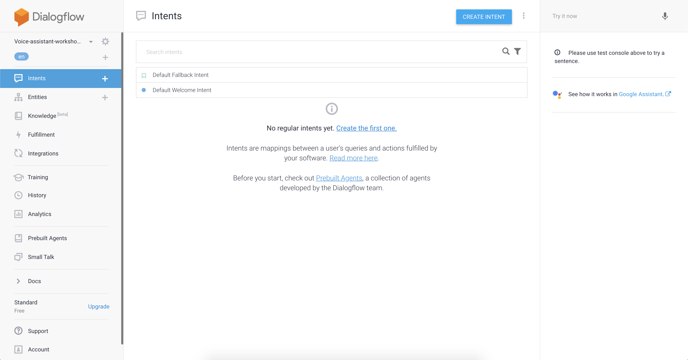
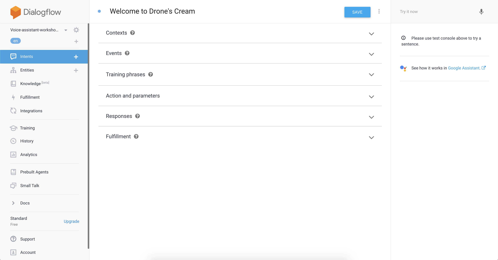
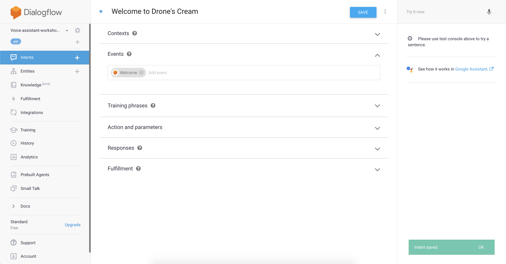
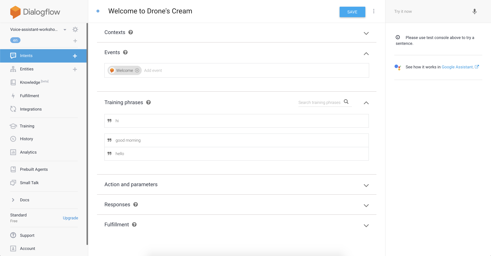
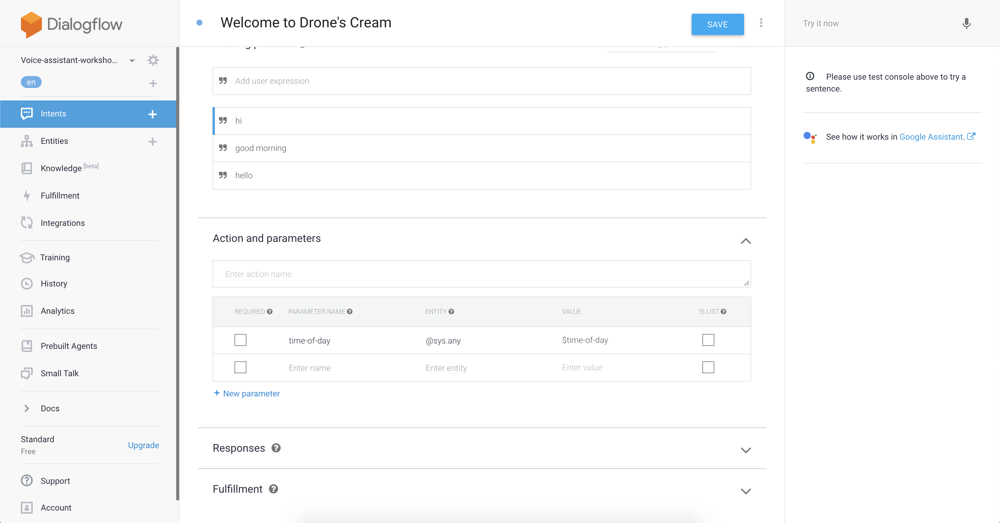
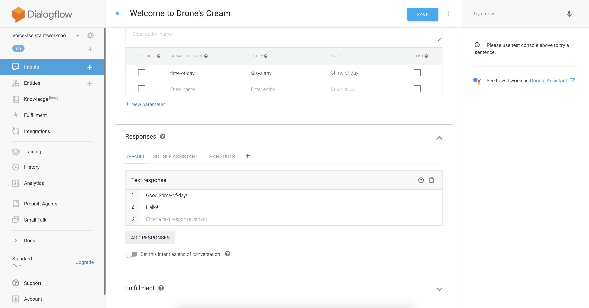
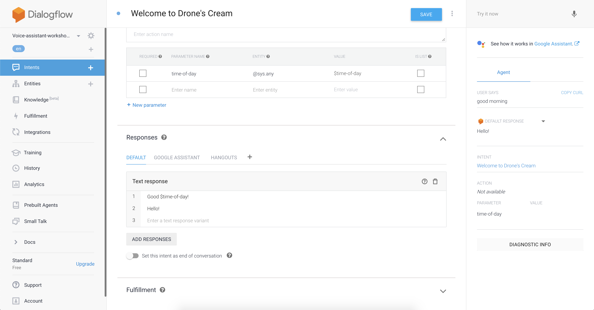

author: Mathias Johan Johansen and Ingrid Grønlie Guren 
id: introduction-to-voice-assistant-solutions

#Solutions: Introduction to Voice Assistant with Google Home

##About the solution

Find any mistakes or improvements? 😇 Please let us know.

We would love to get feedback to improve our workshop. You are awesome if you have time to fill out . It is of course anonymous.

###Any questions?

Contact us on [@mathjoh91](https://twitter.com/mathjoh91) or [@ingridguren](https://twitter.com/ingridguren).

##Part 1: Task 1

La oss skrive løsning på oppgave 1 her

####Step 0

####Step 1

####Step 2

####Step 3
Add some training phrases to let the intent know what it should react on. 

####Step 4
Store the paramter you might receive in a variable that you can access later. 

####Step 5
Add your own custom responses that you want to send when receiving a welcome message. Use the variable you created in step 4. 

####Step 6
Verify your results by trying your new intent with your microphone on the right side of the screen. The results should be one of your predefined responses.  

##Part 1: Task 2

La oss skrive løsning på oppgave 2 her

##Part 2: Task 1

La oss skrive løsning på oppgave 1?

##Part 2: Task 2

la oss skrive mer 

