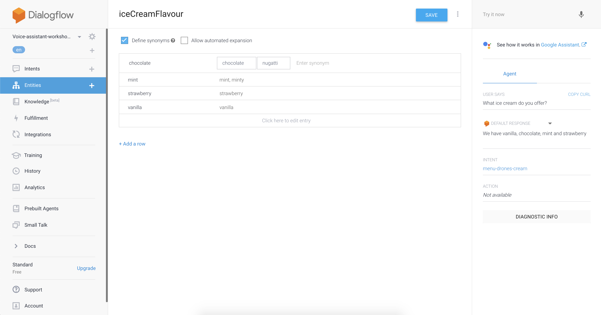

author: Mathias Johan Johansen and Ingrid Grønlie Guren 
id: introduction-to-voice-assistant-solutions

#Solutions: Introduction to Voice Assistant with Google Home

##About the solution

Find any mistakes or improvements? 😇 Please let us know.

We would love to get feedback to improve our workshop. You are awesome if you have time to fill out . It is of course anonymous.

###Any questions?

Contact us on [@mathjoh91](https://twitter.com/mathjoh91) or [@ingridguren](https://twitter.com/ingridguren).

##Task 1

####Step 1

####Step 2

####Step 3

####Step 4
Add some training phrases to let the intent know what it should react on. 

####Step 5
Store the paramter you might receive in a variable that you can access later. 

####Step 6
Add your own custom responses that you want to send when receiving a welcome message. Use the variable you created in step 4. 

####Step 7
Verify your results by trying your new intent with your microphone on the right side of the screen. The results should be one of your predefined responses.  

##Task 2

####Step 1
First give your intent a good name so you will be able to find it later on. 

####Step 2
Add some training phrases to let the intent know what you want it to react on. Save the intent to start the training.

####Step 3
Define your response based on the questions you will receive. You might add more than one response to make the conversation with your voice assistant look better. 

####Step 4
Verify your results by trying your new intent with your microphone on the right side of the screen. The results should be your predefined response(s).  

##Task 3

####Step 1
First create an entity where you want to store all your available variables.  

####Step 2
Add a name you want to use for accessing your entity. 

####Step 3
Add all available flavours and how their corresponding values. You could also add multiple names for each of the flavours if you thing it is needed to get a smooth conversation with your customer.  

####Step 4
Add synonyms for your flavours if you like

##Task 3

####Step 1

####Step 2

####Step 3

####Step 4

####Step 5

####Step 6

####Step 7

####Step 8

